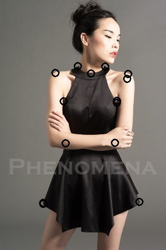
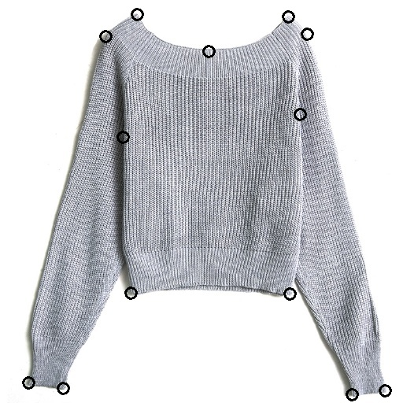
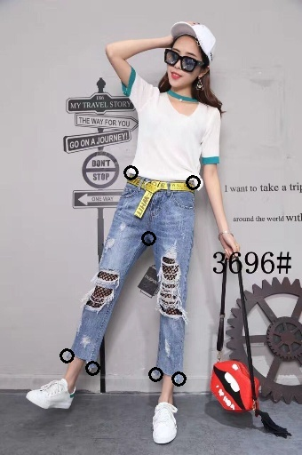

# AiFashion

- Author: VictorLi, yuanyuan.li85@gmail.com
- Code for  FashionAI Global Challenge—Key Points Detection of Apparel
[2018 TianChi](https://tianchi.aliyun.com/competition/introduction.htm?spm=5176.100068.5678.1.4ccc289bCzDJXu&raceId=231648&_lang=en_US)
- Rank 45/2322 at 1st round competition, score 0.61
- Rank 46 at 2nd round competition, score 0.477

## Images with detected keypoints
### Dress

### Blouse

### Outwear

### Skirt

### Trousers



## Basic idea
- The key idea comes from paper [Cascaded Pyramid Network for Multi-Person Pose Estimation](https://arxiv.org/abs/1711.07319). We have a 2 stage network called global net and refine net who are U-net like. The network was trained to detect the heatmap of cloth's key points. The backbone network used here is resnet101.  
- To overcome the negative impact from different category, `input_mask` was introduced to zero the invalid keypoints. For example, skirt has 4 valid keypoints: `waistband_left`, `waistband_right`, `hemline_left` and `hemline_right`. In `input_mask`, only those valid masks are 1.0 , while other 20 masks are set as zero.
- On line hard negative mining, at last stage of refinenet, only take the top losses as consideration and ignore the easy part (small loss)

## Dependency
- Keras2.0
- Tensorflow
- Opencv/Numpy/Pandas
- Pretrained model weights, resenet101

## Folder Structure
- `data`: folder to store training and testing images and annotations
- `trained_models`: folder to store trained models and logs
- `submission`: folder to store generated submission for evaluation.
- `src`: folder to put all of source code.  
`src/data_gen`: code for data generator including data augmentation and pre-process  
`src/eval`: code for evaluation, including inference and post-processing.  
`src/unet`: code for cnn model definition, including train, fine-tune, loss, optimizer definition.  
`src/top`:top level code for train, test and demo.   

## How to train network  
- Download dataset from competition webpage and put it under data.  
  `data/train` : data used as train. `data/test` : data used for test  
- Download [resnet101](https://gist.github.com/flyyufelix/65018873f8cb2bbe95f429c474aa1294) model and save it as `data/resnet101_weights_tf.h5`.   
Note: all the models here use channel_last dim order.
- Train all-in-one network from scratch  
```
python train.py --category all --epochs 30 --network v11 --batchSize 3 --gpuID 2
```
- The trained model and log will be put under `trained_models/all/xxxx`, i.e `trained_models/all/2018_05_23_15_18_07/`  
- The evaluation  will run for each epoch and details saved to `val.log`
- Resume training from a specific model.  
```
python train.py --gpuID 2 --category all --epochs 30 --network v11 --batchSize 3 --resume True --resumeModel /path/to/model/start/with --initEpoch 6
```

## How to test and generate submission
- Run test and generate submission
Below command search the best score from `modelpath` and use that to generate submission  
```
python test.py --gpuID 2 --modelpath ../../trained_models/all/xxx --outpath ../../submission/2018_04_19/ --augment True
```
The submission will be saved as `submission.csv`

## How to run demo
- Download the pre trained weights from [BaiduDisk](https://pan.baidu.com/s/1t7fB5wnRfW1Vny0gw7xUDQ) (password `1ae2`) or [GoogleDrive](https://drive.google.com/open?id=1VY-AO2F1XMQLBjEZjy6CrOSIPWWaHUGr)
- Save it somewhere, i.e `trained_models/all/fashion_ai_keypoint_weights_epoch28.hdf5`
- Or use your own trained model.
- Run demo and the cloth with keypoints marked will be displayed.   
```
python demo.py --gpuID 2 --modelfile ../../trained_models/all/fashion_ai_keypoint_weights_epoch28.hdf5
```

## Reference
- Resnet 101 Keras : https://github.com/statech/resnet
